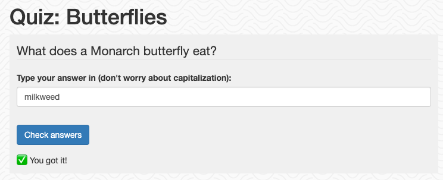

[](https://github.com/codespaces/new?hide_repo_select=true&ref=main&repo=pamelafox%2Fdjango-quiz-app&machine=standardLinux32gb&devcontainer_path=.devcontainer%2Fdevcontainer.json&location=WestUs2)
[](https://vscode.dev/redirect?url=vscode://ms-vscode-remote.remote-containers/cloneInVolume?url=https://github.com%2Fpamelafox%2Fdjango-quiz-app)


# Quizzes app

An example Django app that serves quizzes and lets people know how they scored. Quizzes and their questions are stored in a PostgreSQL database. There is no user authentication or per-user data stored.



The project is designed for deployment on Azure App Service with a PostgreSQL flexible server. See deployment instructions below.


The code is tested with `django.test`, linted with [ruff](https://github.com/charliermarsh/ruff), and formatted with [black](https://black.readthedocs.io/en/stable/). Code quality issues are all checked with both [pre-commit](https://pre-commit.com/) and Github actions.

## Opening the project

This project has [Dev Container support](https://code.visualstudio.com/docs/devcontainers/containers), so it will be be setup automatically if you open it in Github Codespaces or in local VS Code with the [Dev Containers extension](https://marketplace.visualstudio.com/items?itemName=ms-vscode-remote.remote-containers).

If you're not using one of those options for opening the project, then you'll need to:

1. Create a [Python virtual environment](https://docs.python.org/3/tutorial/venv.html#creating-virtual-environments) and activate it.

2. Install the requirements:

    ```shell
    python3 -m pip install -r requirements-dev.txt
    ```

3. Install the pre-commit hooks:

    ```shell
    pre-commit install
    ```

## Local development


1. Create an `.env` file using `.env.sample` as a guide. Set the value of `DBNAME` to the name of an existing database in your local PostgreSQL instance. Set the values of `DBHOST`, `DBUSER`, and `DBPASS` as appropriate for your local PostgreSQL instance. If you're in the devcontainer, copy the values exactly from `.env.sample`.

2. Run the migrations: (Also available as a VS Code task)

    ```
    python3 src/manage.py migrate
    ```

3. Run the local server at port 8000: (Also available as a VS Code task)

    ```
    python3 src/manage.py runserver 8000
    ```

4. Navigate to the displayed URL to verify the website is working.

### Admin

This app comes with the built-in Django admin interface.

1. Create a superuser:

```
python3 manage.py createsuperuser
```

2. Restart the server and navigate to "/admin"

3. Login with the superuser credentials.

### Testing

Run tests:

```
python3 src/manage.py collectstatic
coverage run --source='.' src/manage.py test quizzes
coverage report
```

The same tests are also run as a Github action.


## Deployment

This repository is set up for deployment on Azure App Service (w/PostgreSQL flexible server) using the configuration files in the `infra` folder.

1. Sign up for a [free Azure account](https://azure.microsoft.com/free/) and create an Azure Subscription.
2. Install the [Azure Developer CLI](https://learn.microsoft.com/azure/developer/azure-developer-cli/install-azd). (If you open this repository in Codespaces or with the VS Code Dev Containers extension, that part will be done for you.)
3. Login to Azure:

    ```shell
    azd auth login
    ```

4. Provision and deploy all the resources:

    ```shell
    azd up
    ```

    It will prompt you to provide an `azd` environment name (like "django-app"), select a subscription from your Azure account, and select a location (like "eastus"). Then it will provision the resources in your account and deploy the latest code. If you get an error with deployment, changing the location can help, as there may be availability constraints for some of the resources.

5. To be able to access `/admin`, you'll need a Django superuser. Navigate to the Azure Portal for the App Service, select SSH, and run this command:

    ```
    python manage.py createsuperuser
    ```

6. When you've made any changes to the app code, you can just run:

    ```shell
    azd deploy
    ```

### CI/CD pipeline

This project includes a Github workflow for deploying the resources to Azure
on every push to main. That workflow requires several Azure-related authentication secrets
to be stored as Github action secrets. To set that up, run:

```shell
azd pipeline config
```

## Security

It is important to secure the databases in web applications to prevent unwanted data access.
This infrastructure uses the following mechanisms to secure the PostgreSQL database:

* Azure Firewall: The database is accessible only from other Azure IPs, not from public IPs. (Note that includes other customers using Azure).
* Admin Username: Randomly generated and stored in Key Vault.
* Admin Password: Randomly generated and stored in Key Vault.
* PostgreSQL Version: Latest available on Azure, version 14, which includes security improvements.
* Django Admin Interface: The URL (typically "/admin") is a unique string generated based on the App Service Plan ID.

⚠️ For even more security, consider using an Azure Virtual Network to connect the Web App to the Database.
See [the Django-on-Azure project](https://github.com/tonybaloney/django-on-azure) for example infrastructure files.

### Costs

Pricing varies per region and usage, so it isn't possible to predict exact costs for your usage.

You can try the [Azure pricing calculator](https://azure.com/e/560b5f259111424daa7eb23c6848d164) for the resources:

- Azure App Service: Basic Tier with 1 CPU core, 1.75GB RAM. Pricing is hourly. [Pricing](https://azure.microsoft.com/pricing/details/app-service/linux/)
- PostgreSQL Flexible Server: Burstable Tier with 1 CPU core, 32GB storage. Pricing is hourly. [Pricing](https://azure.microsoft.com/pricing/details/postgresql/flexible-server/)
- Key Vault: Standard tier. Costs are per transaction, a few transactions are used on each deploy. [Pricing](https://azure.microsoft.com/pricing/details/key-vault/)
- Log analytics: Pay-as-you-go tier. Costs based on data ingested. [Pricing](https://azure.microsoft.com/pricing/details/monitor/)

⚠️ To avoid unnecessary costs, remember to take down your app if it's no longer in use,
either by deleting the resource group in the Portal or running `azd down`.


## Getting help

If you're working with this project and running into issues, please post in **Discussions**.
